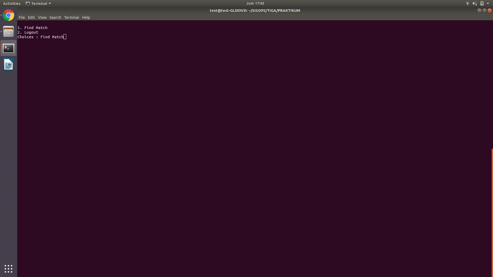
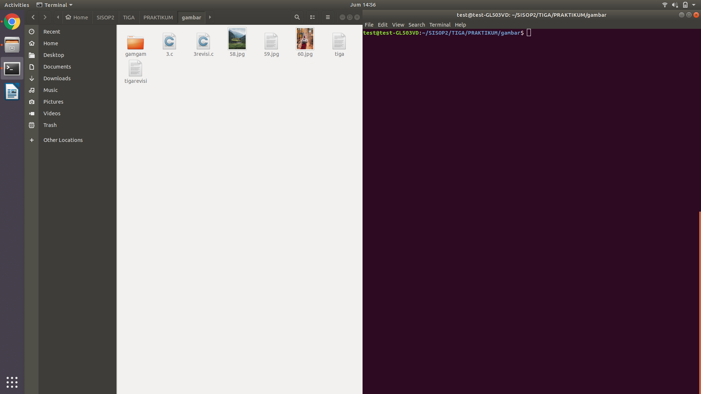
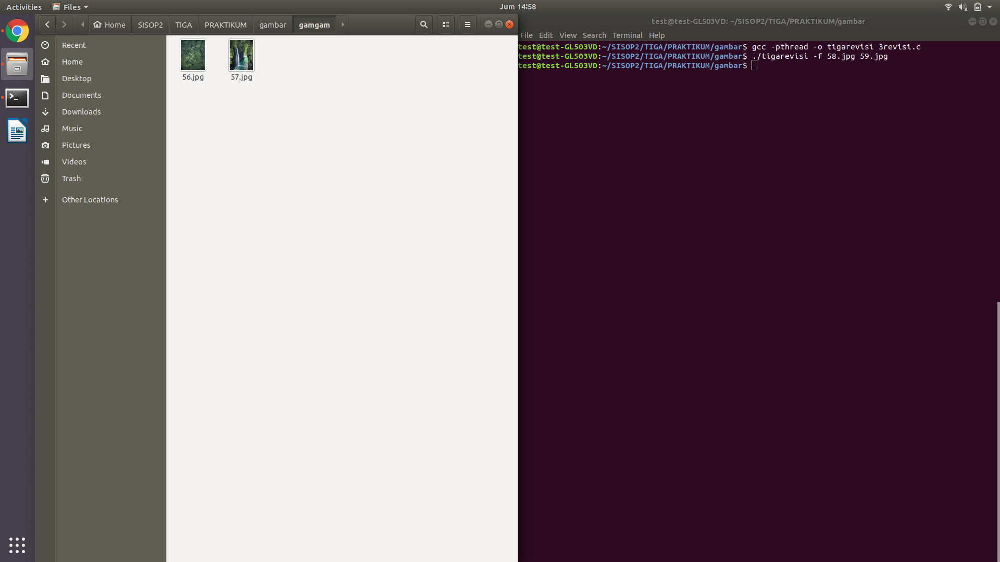
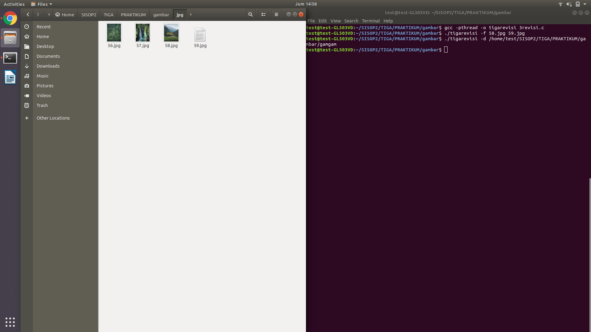
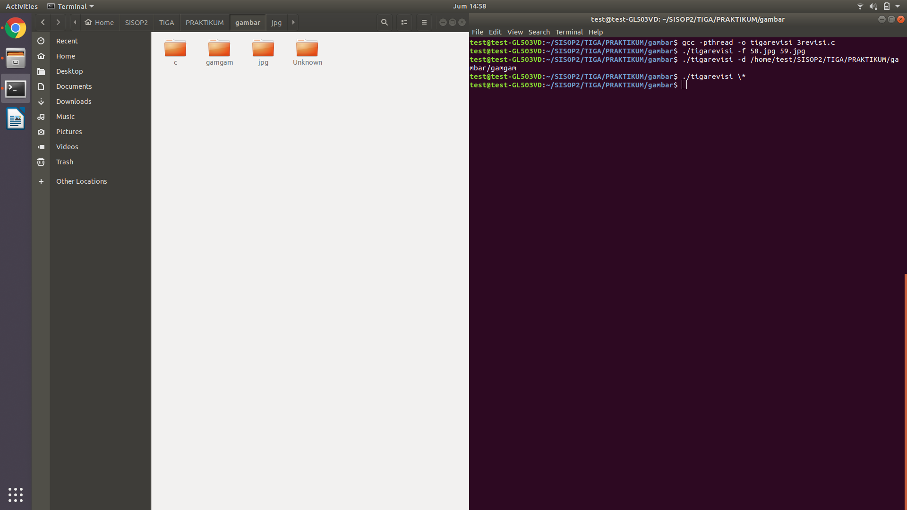

LAPORAN RESMI
SISTEM OPERASI


KELOMPOK : F9

**Oleh:**

Yuki Yanuar Ratna

05111740000023

Rafif Ridho

05111840000058

**Asisten Pembimbing:**

Ibrahim Tamtama Adi

5111640000018

Departemen Teknik Infomatika

Fakultas Teknologi Elektro dan Informatika Cerdas

Institut Teknologi Sepuluh Nopember (ITS)

Surabaya

2020

**Soal**

1.	Poke*ZONE adalah sebuah game berbasis text terminal mirip dengan Pokemon GO. Ketentuan permainan sebagai berikut:

a. Menggunakan IPC-shared memory, thread, fork-exec.

b. Kalian bebas berkreasi dengan game ini asal tidak konflik dengan requirements yang ada. (Contoh: memberi nama trainer, memberi notifikasi kalau barang di shop sudah penuh, dan lain-lain).

c. Terdapat 2 code yaitu soal2_traizone.c dan soal2_pokezone.c.

d. soal2_traizone.c mengandung fitur:

i. Normal Mode (3 Menu)

1. Cari Pokemon

a. Jika diaktifkan maka setiap 10 detik akan memiliki 60% chance untuk menemui pokemon bertipe normal, rare, legendary dengan encounter rate sesuai pada tabel di bawah (Gunakan Thread).

b. Cari pokemon hanya mengatur dia menemukan pokemon atau tidak. Untuk tipe pokemon dan pokemon tersebut shiny atau tidak diatur oleh soal2_pokezone.c.

c. Opsi “Cari Pokemon” akan berubah jadi “Berhenti Mencari” ketika state mencari pokemon aktif.

d. State mencari pokemon hanya bisa dihentikan ketika pokemon sudah ditemukan atau trainer memilih untuk berhenti pada menu.

e. Jika menemui pokemon maka akan masuk ke Capture Mode.

f. Untuk mempermudah boleh menambah menu go to capture mode untuk berpindah dari mode normal ke mode capture setelah menemukan pokemon dari thread Cari Pokemon.


2. Pokedex

a. Melihat list pokemon beserta Affection Point (AP) yang dimiliki.

b. Maksimal 7 pokemon yang dimiliki.

c. Jika menangkap lebih dari 7 maka pokemon yang baru saja ditangkap akan langsung dilepas dan mendapatkan pokedollar sesuai dengan tabel dibawah.

d. Setiap pokemon yang dimiliki, mempunyai Affection Point (AP) dengan initial value 100 dan akan terus berkurang sebanyak -10 AP/10 detik dimulai dari waktu ditangkap (Gunakan Thread).

e. Jika AP bernilai 0, maka pokemon tersebut memiliki 90% chance untuk lepas tanpa memberikan pokedollar ke trainer atau 10% chance untuk reset AP menjadi 50 AP.

f. AP tidak akan berkurang jika dalam Capture Mode.

g. Di Pokedex trainer juga bisa melepas pokemon yang ditangkap dan mendapat pokedollar sesuai dengan
tabel dibawah.

h. Bisa memberi berry ke semua pokemon yang dimiliki untuk meningkatkan AP sebesar +10 (1 berry untuk semua pokemon yang ada di pokedex).


3. Shop

a. Membeli item dari soal2_pokezone.

b. Maksimal masing-masing item yang dapat dibeli dan dipunya oleh trainer adalah 99.


ii. Capture Mode (3 Menu)

1. Tangkap → Menangkap menggunakan pokeball. Berhasil ditangkap maupun tidak, pokeball di inventory -1 setiap
digunakan.

2. Item → Menggunakan item sesuai dengan tabel item dibawah (hanya lullaby powder).

3. Keluar → Keluar dari Capture Mode menuju Normal Mode.

● Pokemon tersebut memiliki peluang untuk lari dari trainer sesuai dengan persentase escape rate pada tabel dibawah
(gunakan thread).

e. soal2_pokezone.c mengandung fitur:

i. Shutdown game → Mematikan program soal2_pokezone dan soal2_traizone (Gunakan fork-exec).

ii. Jual Item (Gunakan Thread)

1. Stock awal semua item adalah 100.

2. Masing-masing item akan bertambah +10 item/10 detik.

3. Maximum item yang dalam shop adalah 200.

4. List item ada pada tabel dibawah.


5. Gunakan thread untuk implementasi lullaby powder dibuatkan masing-masing 1 thread.

iii. Menyediakan Random Pokemon (Gunakan Thread)

1. Setiap tipe pokemon memiliki peluang 1/8000 untuk jadi shiny pokemon. (Random dulu antara normal, rare, legendary sesuai rate mereka, baru setelah itu di random dengan peluang 1/8000 untuk tahu dia shiny atau tidak).

2. Shiny Pokemon meningkatkan escape rate sebesar +5% (misal: tipe normal jadi 10%), capture rate berkurang menjadi -20% (misal: tipe rare jadi 30%), dan pokedollar dari melepas +5000 (misal: tipe legendary jadi 5200 pokedollar).

3. Setiap 1 detik thread ini akan mengkalkulasi random ulang lagi untuk nantinya diberikan ke soal2_traizone.


**Jawaban :**

**Cara Pengerjaan**

**Kendala Yang Dialami**

**Screenshot**


**Soal**

2.	Qiqi adalah sahabat MamMam dan Kaka. Qiqi , Kaka dan MamMam sangat senang bermain “Rainbow six” bersama-sama , akan tetapi MamMam sangat Toxic ia selalu melakukan Team killing kepada Qiqi di setiap permainannya. Karena Qiqi orang yang
baik hati, meskipun marah Qiqi selalu berkata “Aku nggk marah!!”. Kaka ingin meredam kemarahan Qiqi dengan membuatkannya sebuah game yaitu TapTap Game. akan tetapi Kaka tidak bisa membuatnya sendiri, ia butuh bantuan mu. Ayo!! Bantu Kaka menenangkan Qiqi. TapTap Game adalah game online berbasis text console. Terdapat 2 program yaitu tapserver.c dan tapplayer.c

Syarat :

- Menggunakan Socket, dan Thread
Hint :

- fwrite, fread

Spesifikasi Game :


CLIENT SIDE


Screen 1 :

1. Login

2. Register

Choices : {your input}

★ Pada screen 1 kalian dapat menginputkan “login”, setelah menekan enter anda diminta untuk menginputkan username dan password seperti berikut


Screen 1 :

1. Login

2. Register

Choices : login

Username : { ex : qiqi }

Password : { ex : aku nggak marah!! }

★ Jika login berhasil maka akan menampilkan pesan “login success”, jika gagal akan menampilkan pesan “login failed” (pengecekan login hanya mengecek username dan password, maka dapat multi autentikasi dengan username dan password yang sama)

★ Pada screen 1 kalian juga dapat menginputkan “register”, setelah menekan enter anda diminta untuk menginputkan username dan password sama halnya seperti login

★ Pada register tidak ada pengecekan unique username, maka setelah register akan langsung menampilkan pesan “register success” dan dapat terjadi double account

★ Setelah login berhasil maka anda berpindah ke screen 2 dimana menampilkan 2 fitur seperti berikut.


Screen 2 :

1. Find Match

2. Logout

Choices : {your input}

★ Pada screen 2 anda dapat menginputkan “logout” setelah logout anda akan kembali ke screen 1

★ Pada screen 2 anda dapat menginputkan “find”, setelah itu akan menampilkan pesan “Waiting for player ...” print terus sampai menemukan lawan

★ Jika menemukan lawan maka akan menampilkan pesan “Game dimulai silahkan tap tap secepat mungkin !!”

★ Pada saat game dimulai diberikan variable health = 100,dan anda dapat men-tap (menekan space pada keyboard tanpa harus menekan enter)

★ Pada saat anda men-tap maka akan menampilkan pesan “hit !!”, dan pada lawan healthnya akan berkurang sebanyak 10 kemudian pada lawan menampilkan pesan status healthnya sekarang. (conclusion : anda tidak bisa melihat status health lawan)

★ Jika health anda <= 0 maka akan menampilkan pesan “Game berakhir kamu kalah”, apabila lawan anda healthnya <= 0 maka akan menampilkan pesan ”Game berakhir kamu menang”

★ Setelah menang atau kalah maka akan kembali ke screen 2


SERVER SIDE

★ Pada saat program pertama kali dijalankan maka program akan membuat file akun.txt jika file tersebut tidak ada. File tersebut digunakan untuk menyimpan username dan password

★ Pada saat user berhasil login maka akan menampilkan pesan “Auth success” jika gagal “Auth Failed”

★ Pada saat user sukses meregister maka akan menampilkan List account yang terdaftar (username dan password harus terlihat)

**Jawaban :**

Server

```
#include <stdio.h>
#include <sys/socket.h>
#include <sys/types.h>
#include <sys/stat.h>
#include <stdlib.h>
#include <wait.h>
#include <netinet/in.h>
#include <string.h>
#include <unistd.h>
#include <pthread.h>
#include <sys/ipc.h>
#include <sys/shm.h>
#define PORT 8080

pthread_t tid;
void *make_file(void *);

int cfileexists(const char *filename) {
	FILE *file;
	if (file = fopen(filename,"r")) {
		fclose(file);
		return 1;
	}
	return 0;
}

void *make_file(void *arg)
{
	char *argv[3] = {"touch","akun.txt",NULL};
	execv("/usr/bin/touch", argv);

	return NULL;
}

int main(int argc, char const *argv[]) {
    	int server_fd, new_socket, valread, valread2, valread3, valread4, valread5, valread6;
    	struct sockaddr_in address;
    	int opt = 1;
    	int addrlen = sizeof(address);
    	char buffer[1024] = {0};
	char buffer2[1024] = {0};
	char buffer3[1024] = {0};
        char buffer4[1024] = {0};
        char buffer5[1024] = {0};
        char buffer6[1024] = {0};
    	char *hello = "Hello from server";

    	if ((server_fd = socket(AF_INET, SOCK_STREAM, 0)) == 0) {
        	perror("socket failed");
        	exit(EXIT_FAILURE);
    	}

    	if (setsockopt(server_fd, SOL_SOCKET, SO_REUSEADDR | SO_REUSEPORT, &opt, sizeof(opt))) {
        	perror("setsockopt");
        	exit(EXIT_FAILURE);
    	}

    	address.sin_family = AF_INET;
    	address.sin_addr.s_addr = INADDR_ANY;
    	address.sin_port = htons( PORT );

    	if (bind(server_fd, (struct sockaddr *)&address, sizeof(address))<0) {
        	perror("bind failed");
        	exit(EXIT_FAILURE);
    	}

    	if (listen(server_fd, 3) < 0) {
        	perror("listen");
        	exit(EXIT_FAILURE);
    	}

    	if ((new_socket = accept(server_fd, (struct sockaddr *)&address, (socklen_t*)&addrlen))<0) {
        	perror("accept");
        	exit(EXIT_FAILURE);
    	}

	char *arr[] = {"hai", "hai"};
	char **ptr = arr;
	char *filename = "akun.txt";
	int exist = cfileexists(filename);
	if(exist)
	{
		printf("File exist\n");
	}
	else
	{
		pthread_create(&tid, NULL, make_file, NULL);
		pthread_join(tid,NULL);
		valread = read( new_socket , buffer, 1024);
		valread2 = read( new_socket , buffer2, 1024);
		FILE *fp;
		fp = fopen("akun.txt", "w");
		fwrite(buffer, 1, sizeof(buffer), fp);
		fwrite(buffer2, 1, sizeof(buffer2), fp);
		fclose(fp);
		valread3 = read( new_socket , buffer3, 1024);
		if(strcmp(buffer3, "login") == 0)
		{
			valread4 = read( new_socket , buffer4, 1024);
		}
		else
		{
			valread5 = read( new_socket , buffer5, 1024);
			valread6 = read( new_socket , buffer6, 1024);
			int awal = sizeof(arr)/sizeof(arr[0]);
			int i;
			for(i=0;i<2;i++)
			{
				ptr[awal+1] = buffer5;
				ptr[awal+2] = buffer6;
			}
			for(i=0;i<awal+2;i=i+2)
			{
				printf("%s\t", ptr[i]);
				printf("%s\n", ptr[i+1]);
			}
		}
	}

    return 0;
}
```

Client

```
#include <sys/wait.h>
#include <sys/types.h>
#include <sys/stat.h>
#include <syslog.h>
#include <fcntl.h>
#include <errno.h>
#include <stdio.h>
#include <sys/socket.h>
#include <stdlib.h>
#include <netinet/in.h>
#include <string.h>
#include <unistd.h>
#include <arpa/inet.h>
#define PORT 8080

int main(int argc, char const *argv[]) {
	struct sockaddr_in address;
	int sock = 0, valread;
    	struct sockaddr_in serv_addr;
    	char *hello = "Auth Success";
	char *hello2 = "Auth Failed";
    	char buffer[1024] = {0};
	char input1[10];
	char input2[10];
	char *username;
	char *password;
	char *usernamebenar = "hai";
	char *passwordbenar = "hai";
	char *login = "login";
	char *registerr = "register";
    	if ((sock = socket(AF_INET, SOCK_STREAM, 0)) < 0) {
        	printf("\n Socket creation error \n");
        	return -1;
    	}

    	memset(&serv_addr, '0', sizeof(serv_addr));

    	serv_addr.sin_family = AF_INET;
    	serv_addr.sin_port = htons(PORT);

    	if(inet_pton(AF_INET, "127.0.0.1", &serv_addr.sin_addr)<=0) {
        	printf("\nInvalid address/ Address not supported \n");
       		return -1;
    	}

    	if (connect(sock, (struct sockaddr *)&serv_addr, sizeof(serv_addr)) < 0) {
        	printf("\nConnection Failed \n");
        	return -1;
    	}
	system("clear");
	while(1)
	{
	        send(sock , usernamebenar , strlen(usernamebenar) , 0 );
	        send(sock , passwordbenar , strlen(passwordbenar) , 0 );
		printf("1. Login\n");
		printf("2. Register\n");
		printf("Choices : ");
		scanf("%s", input1);
		if(strcmp(input1,"Login")==0)
		{
			send(sock , login , strlen(login) , 0 );
			printf("Username: ");
			scanf("%s", username);
			printf("password: ");
			scanf("%s", password);
			if(strcmp(username,"hai")==0 && strcmp(password,"hai")==0)
			{
				send(sock , hello , strlen(hello) , 0 );
				printf("Login Success\n");
			}
			else
			{
				send(sock , hello2 , strlen(hello2) , 0 );
				printf("Login Failed\n");
			}
		}
		else
		{
			send(sock , registerr , strlen(registerr) , 0 );
			printf("Username: ");
                	scanf("%s", username);
			send(sock , username , strlen(username) , 0 );
                	printf("password: ");
                	scanf("%s", password);
                        send(sock , password , strlen(password) , 0 );
			printf("Register Success\n");
		}
		sleep(1);
		system("clear");
        	printf("\n1. Find Match\n");
        	printf("2. Logout\n");
        	printf("Choices : ");
        	scanf("%s", input2);
		if (strcmp(input2, "Logout")==0)
		{
			sleep(1);
			system("clear");
		}
		else
		{
			int i=0;
			while(1)
			{
				printf("Waiting for player ...\n");
				//valread = read( sock, buffer, 1024);
				//if(strcmp(buffer,"ayo")==0)
				i++;
				if(i==2)
				{
					break;
				}
			}
			printf("Game dimulai silahkan tap tap secepat mungkin !!\n");
			int healthA=100;
			int c;
			while(getchar() == 32)
			{
				printf("hit!!\n");
			}
		}
		//sleep(1);
		//system("clear");
	}

    	return 0;
}
```

**Cara Pengerjaan**

**Kendala Yang Dialami**

Game belum dapat dimainkan

**Screenshot**




**Soal**

3.	Buatlah sebuah program dari C untuk mengkategorikan file. Program ini akan memindahkan file sesuai ekstensinya (tidak case sensitive. JPG dan jpg adalah sama) ke dalam folder sesuai ekstensinya yang folder hasilnya terdapat di working directory ketika program kategori tersebut dijalankan.

● Semisal program dijalankan:

File kategori terletak di /home/izone/kategori

$ ./kategori -f path/to/file1.jpg path/to/file2.c path/to/file3.zip

#Hasilnya adalah sebagai berikut

/home/izone

|-jpg

|--file1.jpg

|-c

|--file2.c

|-zip

|--file3.zi

● Pada opsi -f tersebut, user bisa menambahkan argumen file yang bisa dikategorikan sebanyak yang user inginkan seperti contoh di atas.

● Pada program kategori tersebut, folder jpg,c,zip tidak dibuat secara manual, melainkan melalui program c. Semisal ada file yang tidak memiliki ekstensi, maka dia akan disimpan dalam folder “Unknown”.

● Program kategori ini juga menerima perintah (*) seperti di bawah;

$ ./kategori \*

● Artinya mengkategori seluruh file yang ada di working directory ketika menjalankan program C tersebut.

● Selain hal itu program C ini juga menerima opsi -d untuk melakukan kategori pada suatu directory. Untuk opsi -d ini, user hanya bisa menginput 1 directory saja, tidak seperti file yang bebas menginput file sebanyak mungkin.
$ ./kategori -d /path/to/directory/

● Hasilnya perintah di atas adalah mengkategorikan file di /path/to/directory dan hasilnya akan disimpan di working directory di mana program C tersebut berjalan (hasil kategori filenya bukan di /path/to/directory).

● Program ini tidak rekursif. Semisal di directory yang mau dikategorikan, atau menggunakan (*) terdapat folder yang berisi file, maka file dalam folder tersebut tidak dihiraukan, cukup file pada 1 level saja.

● Setiap 1 file yang dikategorikan dioperasikan oleh 1 thread agar bisa berjalan secara paralel sehingga proses kategori bisa berjalan lebih cepat. Dilarang juga menggunakan fork-exec dan system.

● Silahkan download soal3.zip sebagai percobaan. Namun silahkan dicoba-coba sendiri untuk kemungkinan test case lainnya yang mungkin belum ada di soal3.zip.

**Jawaban :**

**Cara Pengerjaan**
```
#include<stdio.h>
#include<string.h>
#include<pthread.h>
#include<stdlib.h>
#include<unistd.h>
#include<sys/types.h>
#include<sys/stat.h>
#include<sys/wait.h>
#include<dirent.h>

pthread_t tid[500];
char *workDir;
char *tempDir;
int currentInd;
void moveFile(char src[], char dst[]);
char* getFilename(char str[]);
char* getExtension(char str[]);

void* kategoriSatu(void *arg)
{
	pthread_t id=pthread_self();
	int i;
	char *extension;
	char destination[500];
	char path[500];
	extension = getExtension((char *)arg);

	if(extension == NULL)
	{
		strcpy(destination, "Unknown");
	}
	else
	{
		strcpy(destination, extension);
		//mengubah jika extension berhuruf besar diselaraskan ke huruf kecil
		for(i=0;i<strlen(destination);i++)
		{
			//64 = DEC from @
			//91 = DEC from [
			//32 kembali ke alphabet huruf kecil dari a
			if(destination[i]>64 && destination[i]<91)
			{
				destination[i]+=32;
			}
		}
	}

	if(mkdir(destination,0777) == -1);

	snprintf(path,500,"%s/%s/%s",workDir,destination,getFilename((char *)arg));
	moveFile((char *)arg, path);
	return NULL;
}

void* kategoriDua(void *arg)
{
	pthread_t id = pthread_self();
	char *extension;
	char destination[500];
	int i;
	char sourceFolder[500];
	char destinationFolder[500];
	extension = getExtension((char *)arg);

	if(extension == NULL)
	{
		strcpy(destination,"Unknown");
	}
	else
	{
                strcpy(destination, extension);
                //mengubah jika extension berhuruf besar diselaraskan ke huruf kecil
                for(i=0;i<strlen(destination);i++)
                {
                        //64 = DEC from @
                        //91 = DEC from [
                        //32 kembali ke alphabet huruf kecil dari a
                        if(destination[i]>64 && destination[i]<91)
                        {
                                destination[i]+=32;
                        }
                }

	}

	if(mkdir(destination,0777) == -1);

	snprintf(sourceFolder,500,"%s/%s",workDir,(char *)arg);
	snprintf(destinationFolder,500,"%s/%s/%s",workDir,destination,getFilename((char *)arg));
	moveFile(sourceFolder,destinationFolder);
	return NULL;
}

void* kategoriTiga(void *arg)
{
	pthread_t id = pthread_self();
	char *extension;
	char destination[500];
	int i;
	char sourceFolder[500];
	char destinationFolder[500];
	extension = getExtension((char *)arg);

	if(extension == NULL)
	{
		strcpy(destination,"Unknown");
	}
	else
	{
		strcpy(destination,extension);
		for(i=0;i<strlen(destination);i++)
		{
			if(destination[i]>64 && destination[i]<91)
			{
				destination[i]+=32;
			}
		}
	}
	char pathhh[42] = "/home/test/SISOP2/TIGA/PRAKTIKUM/gambar";
	chdir(pathhh);
	if(mkdir(destination,0777) == -1);

	snprintf(sourceFolder,500,"%s/%s",tempDir,(char *)arg);
	snprintf(destinationFolder,500,"%s/%s/%s",pathhh,destination,getFilename((char *)arg));
	moveFile(sourceFolder,destinationFolder);
	return NULL;
}

int main(int argc, char **arg2)
{
	char buffer[500];
	workDir = getcwd(buffer,500);
	int i=2,j,cek;

	if(!strcmp(arg2[1],"-f"))
	{
		while (arg2[i] != NULL)
		{
			cek = pthread_create(&(tid[i-2]),NULL,&kategoriSatu,(void *)arg2[i]);
			if(cek!=0)
			{
				printf(" ");
			}
			i++;
		}
		for(j=0;j<(i-1);j++)
		{
			pthread_join(tid[j],NULL);
		}
	}
	else if (!strcmp(arg2[1],"*"))
	{
		DIR *d;
		struct dirent *direktori;
		struct stat File;
		d = opendir(".");
		if(d)
		{
			while((direktori = readdir(d))!=NULL)
			{
				if(stat(direktori->d_name,&File)<0);
				else if(!S_ISDIR(File.st_mode))
				{
	        	                cek = pthread_create(&(tid[i-2]),NULL,&kategoriDua,(void *)direktori->d_name);
					if(cek!=0)
					{
						printf(" ");
					}
        	        	        i++;
				} 
				else;
			}
                	for(j=0;j<(i-1);j++)
               		{
                        	pthread_join(tid[j],NULL);
                	}
		}
	}
	else if(!strcmp(arg2[1],"-d"))
	{
		chdir(arg2[2]);
		tempDir = getcwd(buffer,500);
		DIR *d;
                struct dirent *direktori;
                struct stat File;
                d = opendir(".");
                if(d)
                {
                        while((direktori = readdir(d))!=NULL)
                        {
                                if(stat(direktori->d_name,&File)<0);
                                else if(!S_ISDIR(File.st_mode))
                                {
                                        cek = pthread_create(&(tid[i-2]),NULL,&kategoriTiga,(void *)direktori->d_name);
					if(cek!=0)
					{
						printf(" ");
					}
                                        i++;
                                }
				else;
                        }
                        for(j=0;j<(i-1);j++)
                        {
                                pthread_join(tid[j],NULL);
                        }
                }
	}
	return 0;
}

void moveFile(char src[], char dst[])
{
	FILE *file1, *file2;
	int charr;

	file1 = fopen(src,"r");
	file2 = fopen(dst,"w");

	if(!file1)
	{
		fclose(file2);
		return ;
	}
	if(!file2)
	{
		return ;
	}
	while((charr=fgetc(file1)) != EOF)
	{
		fputc(charr,file2);
	}

	fclose(file1);
	fclose(file2);

	remove(src);
	return ;
}

char* getFilename(char str[])
{
	char* stop;
	char* final;
	stop = strchr(str,'/');
	if(stop == NULL)
	{
		return str;
	}
	while(stop != NULL)
	{
		final = stop+1;
		stop = strchr(stop+1,'/');
	}
	return final;
}

char* getExtension(char str[])
{
	char* stop = getFilename(str);
	char* final = strchr(stop,'.');
	if(final == NULL)
	{
		return NULL;
	}
	else
	{
		return (final+1);
	}
}
```

**Kendala Yang Dialami**

-

**Screenshot**










4.	Norland adalah seorang penjelajah terkenal. Pada suatu malam Norland menyusuri jalan setapak menuju ke sebuah gua dan mendapati tiga pilar yang pada setiap pilarnya ada sebuah batu berkilau yang tertancap. Batu itu berkilau di kegelapan dan
setiap batunya memiliki warna yang berbeda. Norland mendapati ada sebuah teka-teki yang tertulis di setiap pilar. Untuk dapat mengambil batu mulia di suatu pilar, Ia harus memecahkan teka-teki yang ada di pilar tersebut. Norland menghampiri setiap pilar secara bergantian.

- Batu mulia pertama. Emerald. Batu mulia yang berwarna hijau mengkilat. Pada batu itu Ia menemukan sebuah kalimat petunjuk. Ada sebuah teka-teki yang berisi:

1. Buatlah program C dengan nama "4a.c", yang berisi program untuk melakukan perkalian matriks. Ukuran matriks pertama adalah 4x2, dan matriks kedua 2x5. Isi dari matriks didefinisikan di dalam kodingan. Matriks nantinya akan berisi angka 1-20 (tidak perlu dibuat filter angka).

2. Tampilkan matriks hasil perkalian tadi ke layar.

- Batu kedua adalah Amethyst. Batu mulia berwarna ungu mengkilat. Teka-tekinya
adalah:

1. Buatlah program C kedua dengan nama "4b.c". Program ini akan mengambil variabel hasil perkalian matriks dari program "4a.c" (program sebelumnya), dan tampilkan hasil matriks tersebut ke layar.

(Catatan!: gunakan shared memory)

2. Setelah ditampilkan, berikutnya untuk setiap angka dari matrikstersebut, carilah nilai faktorialnya, dan tampilkan hasilnya ke layar dengan format seperti matriks.

Contoh: misal array [[1, 2, 3, 4], [5, 6, 7, 8], [9, 10, 11, 12], ...],

maka:

1 2 6 24

120 720 ... ...

...

(Catatan! : Harus menggunakan Thread dalam penghitungan faktorial)

- Batu ketiga adalah Onyx. Batu mulia berwarna hitam mengkilat. Pecahkan teka-teki berikut!

1. Buatlah program C ketiga dengan nama "4c.c". Program ini tidak memiliki hubungan terhadap program yang lalu.

2. Pada program ini, Norland diminta mengetahui jumlah file dan folder di direktori saat ini dengan command "ls | wc -l". Karena sudah belajar IPC, Norland mengerjakannya dengan semangat.

(Catatan! : Harus menggunakan IPC Pipes)

Begitu batu terakhir berhasil didapatkan. Gemuruh yang semakin lama semakin besar terdengar. Seluruh tempat berguncang dahsyat, tanah mulai merekah. Sebuah batu yang di atasnya terdapat kotak kayu muncul ke atas dengan sendirinya.

Sementara batu tadi kembali ke posisinya. Tanah kembali menutup, seolah tidak pernah ada lubang merekah di atasnya satu detik lalu. Norland segera memasukkan tiga buah batu mulia Emerald, Amethys, Onyx pada Peti Kayu. Maka terbukalah Peti Kayu tersebut. Di dalamnya terdapat sebuah harta karun rahasia. Sampai saat ini banyak orang memburu harta karun tersebut. Sebelum menghilang, dia menyisakan semua petunjuk tentang harta karun tersebut melalui tulisan dalam buku catatannya yang tersebar di penjuru dunia. "One Piece

**Jawaban :**

**Cara Pengerjaan**

4. a

```
#include <stdio.h>
#include <pthread.h>
#include <sys/ipc.h>
#include <sys/shm.h>
#include <unistd.h>

int matrix1[10][10];
int matrix2[10][10];
int (*hasil)[10];
int baris1=4;
int kolom1=2;
int baris2=2;
int kolom2=5;
int status;

pthread_t tid1, tid2, tid3;

void *multiply_matrix(void *);
void *fill_matrix1(void *);
void *fill_matrix2(void *);

void *fill_matrix1(void *arg)
{
	status=0;
        matrix1[0][0]=1;
        matrix1[0][1]=1;
        matrix1[1][0]=1;
        matrix1[1][1]=1;
        matrix1[2][0]=1;
        matrix1[2][1]=1;
        matrix1[3][0]=1;
        matrix1[3][1]=1;

	status=1;
	return NULL;
}

void *fill_matrix2(void *arg)
{
	while(status!=1)
	{

	}
        matrix2[0][0]=1;
        matrix2[0][1]=1;
        matrix2[0][2]=1;
        matrix2[0][3]=1;
        matrix2[0][4]=1;
        matrix2[1][0]=1;
        matrix2[1][1]=1;
        matrix2[1][2]=1;
        matrix2[1][3]=1;
        matrix2[1][4]=1;

	status=2;
	return NULL;
}

void *multiply_matrix(void *arg)
{
	while(status!=2)
	{

	}
	int i, j, k;
	for(i=0;i<baris1;i++)
	{
		for(j=0;j<kolom2;j++)
		{
			for(k=0;k<kolom1;k++)
			{
				hasil[i][j]+=matrix1[i][k] * matrix2[k][j];
			}
		}
	}
	return NULL;
}

int main()
{
	int i, j;
	key_t key = 1234;
        int shmid = shmget(key, sizeof(int[10][10]), IPC_CREAT | 0666);
        hasil = shmat(shmid, 0, 0);

	pthread_create(&tid1, NULL, fill_matrix1, NULL);
	pthread_join(tid1,NULL);

	pthread_create(&tid2, NULL, fill_matrix2, NULL);
	pthread_join(tid2,NULL);

	for(i=0;i<baris1;i++)
	{
		for(j=0;j<kolom2;j++)
		{
			hasil[i][j]=0;
		}
		pthread_create(&tid3, NULL, multiply_matrix, NULL);
		pthread_join(tid3,NULL);
	}

	printf("Hasil Perkalian\n");
	for(i=0;i<baris1;i++)
	{
		for(j=0;j<kolom2;j++)
		{
			printf("%d\t", hasil[i][j]);
		}
		printf("\n");
	}

	return 0;
}
```

4. b

```
#include <stdio.h>
#include <sys/ipc.h>
#include <sys/shm.h>
#include <unistd.h>
#include <pthread.h>

unsigned long long factorial[10][10];
int baris=4, kolom=5;
void *factorial_matrix(void *);

void *factorial_matrix(void *arg)
{
        key_t key = 1234;
        int (*hasil)[10];

        int shmid = shmget(key, sizeof(int), IPC_CREAT | 0666);
        hasil = shmat(shmid, 0, 0);

	int i,j,k,angka;
	unsigned long long fact=1;
	for(i=0;i<baris;i++)
	{
		for(j=0;j<kolom;j++)
		{
			angka=hasil[i][j];
			//printf("%d\n", angka);
			for(k=1;k<=angka;++k)
			{
				fact*=k;
				factorial[i][j]=fact;
			}
			fact=1;
		}
	}
}

void main()
{
        key_t key = 1234;
        int (*hasil)[10];
	int i,j;

        int shmid = shmget(key, sizeof(int), IPC_CREAT | 0666);
        hasil = shmat(shmid, 0, 0);

	printf("Hasil Perkalian\n");
	for(i=0;i<4;i++)
	{
		for(j=0;j<5;j++)
		{
			printf("%d\t", hasil[i][j]);
		}
		printf("\n");
	}

        //shmdt(value);
        //shmctl(shmid, IPC_RMID, NULL);

	pthread_t tid;

	pthread_create(&tid, NULL, factorial_matrix, NULL);
	pthread_join(tid,NULL);

	printf("Hasil Faktorial\n");
	for(i=0;i<baris;i++)
	{
		for(j=0;j<kolom;j++)
		{
			printf("%llu\t", factorial[i][j]);
		}
		printf("\n");
	}
}
```
4. c

```
#include <stdio.h>
#include <unistd.h>
#include <fcntl.h>
#include <sys/types.h>
#include <sys/stat.h>

int main(int argc, char **argv)
{
  int pipefd[2];
  int pid;

  char *ls_args[] = {"ls", "/home/test/SISOP2/TIGA/PRAKTIKUM", NULL};
  char *wc_args[] = {"wc", "-l", NULL};

  // make a pipe (fds go in pipefd[0] and pipefd[1])

  pipe(pipefd);

  pid = fork();

  if (pid == 0)
    {
      // child gets here and handles "grep Villanova"

      // replace standard input with input part of pipe

      dup2(pipefd[0], 0);

      // close unused hald of pipe

      close(pipefd[1]);

      // execute grep

      execvp("wc", wc_args);
    }
  else
    {
      // parent gets here and handles "cat scores"

      // replace standard output with output part of pipe

      dup2(pipefd[1], 1);

      // close unused unput half of pipe

      close(pipefd[0]);

      // execute cat

      execvp("ls", ls_args);
    }
}
```

**Kendala Yang Dialami**

-

**Screenshot**

4.a


4.b


4.c

